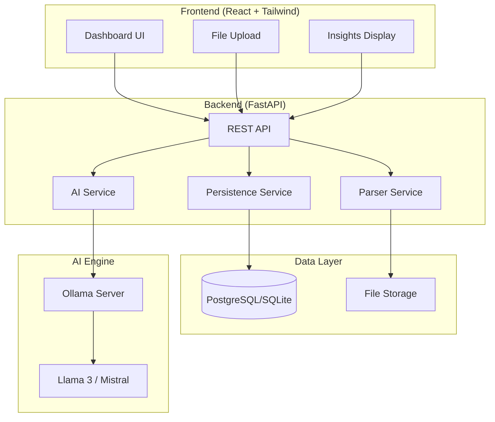

# Grey AI Internal

<div align="center">

**AI-Powered Data Insights Tool for Internal Operations**

[](https://python.org)
[](https://fastapi.tiangolo.com)
[](https://reactjs.org)
[](https://ollama.ai)
[](#)

*Upload CSV or text files → Get AI-generated insights, summaries, and recommendations*

[Quick Start](#-quick-start) • [Architecture](#-architecture) • [API Reference](#-api-reference) • [Deployment](#-deployment) • [Testing](#-testing)

</div>

## WARNING:
There are known bugs, and the AI may be unreliable due to being self-hosted and open-source. Verify stability before deploying in a production environment.

---

## 📋 Table of Contents

- [Why Grey AI Internal?](#-why-grey-ai-internal)
- [Features](#-features)
- [Tech Stack](#-tech-stack)
- [Architecture](#-architecture)
- [Quick Start](#-quick-start)
- [Usage Workflow](#-usage-workflow)
- [API Reference](#-api-reference)
- [AI Prompts & Examples](#-ai-prompts--examples)
- [Testing](#-testing)
- [Deployment](#-deployment)
- [Configuration](#-configuration)
- [Troubleshooting](#-troubleshooting)

---

## 🎯 Why Grey AI Internal?

Grey AI Internal demonstrates **production-ready engineering** for modern AI-integrated applications:

| Value Proposition | Description |
|-------------------|-------------|
| **Internal Tooling Focus** | Purpose-built for operations teams to extract insights from data without data science expertise |
| **No Paid APIs** | Uses local Ollama LLM—zero API costs, full data privacy, works offline |
| **Senior Architecture** | Clean separation of concerns, async patterns, proper error handling, comprehensive testing |
| **Modern Stack** | FastAPI + React + PostgreSQL—technologies in high demand across the industry |
| **Production-Ready** | Docker deployment, CI/CD pipeline, database migrations, environment configuration |

### Alignment with Industry Standards

This project showcases skills commonly requested in senior engineering roles:

- ✅ RESTful API design with FastAPI
- ✅ Async Python with SQLAlchemy 2.0
- ✅ React component architecture with Tailwind CSS
- ✅ LLM integration and prompt engineering
- ✅ Docker containerization and orchestration
- ✅ pytest testing with mocks and fixtures
- ✅ GitHub Actions CI/CD pipelines

---

## ✨ Features

- **File Upload** — Drag-and-drop CSV/TXT files with validation
- **Automatic Parsing** — Extract row counts, column metadata, statistics, and previews
- **AI Analysis** — Generate summaries, insights, and recommendations via local LLM
- **Custom Prompts** — Tailor analysis with specific instructions
- **Clean Dashboard** — Modern React UI with responsive design
- **Full Persistence** — All data and insights stored in database
- **API-First** — Complete REST API with Swagger documentation

---

## 🛠 Tech Stack

```
┌─────────────────────────────────────────────────────────────────┐
│                         GREY AI INTERNAL                         │
├─────────────────────────────────────────────────────────────────┤
│  Frontend         │  Backend          │  AI Engine              │
│  ─────────────    │  ─────────────    │  ─────────────          │
│  React 18         │  FastAPI          │  Ollama                 │
│  Vite             │  Python 3.11      │  Llama 3 / Mistral      │
│  Tailwind CSS     │  SQLAlchemy 2.0   │  Local Inference        │
│  Axios            │  Pydantic v2      │                         │
├─────────────────────────────────────────────────────────────────┤
│  Database         │  DevOps           │  Testing                │
│  ─────────────    │  ─────────────    │  ─────────────          │
│  SQLite (dev)     │  Docker           │  pytest                 │
│  PostgreSQL       │  Docker Compose   │  pytest-asyncio         │
│  Alembic          │  GitHub Actions   │  httpx (async client)   │
└─────────────────────────────────────────────────────────────────┘
```

---

## 🏗 Architecture

### System Diagram



### ASCII Architecture Diagram

```
┌─────────────────────────────────────────────────────────────────────────────┐
│                              USER INTERFACE                                  │
│  ┌─────────────────────────────────────────────────────────────────────┐    │
│  │                         React Dashboard                              │    │
│  │   ┌──────────────┐   ┌───────────────┐   ┌────────────────────┐    │    │
│  │   │ File Upload  │   │ Metrics View  │   │  Insights Panel    │    │    │
│  │   │ (drag/drop)  │   │ (stats/chart) │   │  (AI summaries)    │    │    │
│  │   └──────────────┘   └───────────────┘   └────────────────────┘    │    │
│  └─────────────────────────────────────────────────────────────────────┘    │
└────────────────────────────────────┬────────────────────────────────────────┘
                                     │ HTTP/REST (JSON)
                                     ▼
┌─────────────────────────────────────────────────────────────────────────────┐
│                              BACKEND API                                     │
│  ┌─────────────────────────────────────────────────────────────────────┐    │
│  │                          FastAPI Server                              │    │
│  │                                                                      │    │
│  │   Routes Layer      →    Services Layer     →    Data Layer         │    │
│  │   ──────────────         ─────────────          ──────────          │    │
│  │   /api/upload/           ParserService          SQLAlchemy ORM      │    │
│  │   /api/ai/               AIService               ↓                  │    │
│  │   /health                PersistenceService      PostgreSQL/SQLite  │    │
│  │                                                                      │    │
│  └──────────────────────────────┬──────────────────────────────────────┘    │
└─────────────────────────────────┼───────────────────────────────────────────┘
                                  │ HTTP (async)
                                  ▼
                    ┌───────────────────────────┐
                    │      OLLAMA SERVER        │
                    │   ┌───────────────────┐   │
                    │   │    Local LLM      │   │
                    │   │  (llama3/mistral) │   │
                    │   └───────────────────┘   │
                    │   localhost:11434         │
                    └───────────────────────────┘
```

### Data Flow

```
┌──────────┐     ┌──────────┐     ┌──────────┐     ┌──────────┐     ┌──────────┐
│  Upload  │ ──▶ │  Parse   │ ──▶ │  Store   │ ──▶ │ Analyze  │ ──▶ │ Display  │
│   File   │     │  Data    │     │ Metrics  │     │  (AI)    │     │ Insights │
└──────────┘     └──────────┘     └──────────┘     └──────────┘     └──────────┘
     │                │                │                │                │
     ▼                ▼                ▼                ▼                ▼
  Validate        Extract          Upload +        Call Ollama      Return JSON
  Extension      Statistics       Metrics DB       with prompt       to frontend
  & Size                          records                          
```

### Database Schema

```
┌────────────────┐       ┌─────────────────┐       ┌────────────────┐
│    uploads     │       │     metrics     │       │   ai_outputs   │
├────────────────┤       ├─────────────────┤       ├────────────────┤
│ id (PK)        │──┐    │ id (PK)         │──┐    │ id (PK)        │
│ filename       │  │    │ upload_id (FK)  │◀─┘    │ upload_id (FK) │◀─┐
│ file_path      │  │    │ row_count       │       │ ai_summary     │  │
│ file_type      │  │    │ column_count    │       │ insights_json  │  │
│ file_size      │  └───▶│ columns_json    │       │ ai_recommend.  │  │
│ status         │       │ stats_json      │       │ model_used     │  │
│ created_at     │       │ preview_json    │       │ created_at     │  │
└────────────────┘       └─────────────────┘       └────────────────┘
         │                                                  ▲
         └──────────────────────────────────────────────────┘
                            1:1 relationships
```

---

## 🚀 Quick Start

### Prerequisites

| Requirement | Version | Purpose |
|-------------|---------|---------|
| Python | 3.11+ | Backend runtime |
| Node.js | 18+ | Frontend build |
| Ollama | Latest | Local LLM inference |
| Docker | 20+ | Containerization (optional) |

### Option 1: Docker (Recommended)

The fastest way to run everything:

```bash
# 1. Clone and enter project
cd grey-ai-internal

# 2. Copy environment config
cp .env.example .env

# 3. Start all services
docker-compose up -d --build

# 4. Pull an LLM model (first run only)
docker exec -it grey-ai-ollama ollama pull llama3

# 5. Access the application
#    Frontend:  http://localhost:3000
#    Backend:   http://localhost:8000
#    API Docs:  http://localhost:8000/docs
```

### Option 2: Manual Setup

#### Step 1: Install Ollama

```bash
# macOS/Linux
curl -fsSL https://ollama.com/install.sh | sh

# Pull a model
ollama pull llama3    # Recommended (~8GB)
ollama pull mistral   # Alternative (~4GB)
ollama pull phi3      # Lightweight (~2GB)

# Start Ollama server
ollama serve
```

#### Step 2: Backend Setup

```bash
cd backend

# Create virtual environment
python -m venv venv
source venv/bin/activate  # Windows: venv\Scripts\activate

# Install dependencies
pip install -r requirements.txt

# Configure environment
cp .env.example .env
# Edit .env as needed

# Run database migrations
# Tables are auto-created on first run

# Start the server
uvicorn main:app --reload --host 0.0.0.0 --port 8000
```

#### Step 3: Frontend Setup

```bash
cd frontend

# Install dependencies
npm install

# Start development server
npm run dev
```

### Access Points

| Service | URL | Description |
|---------|-----|-------------|
| Frontend | http://localhost:5173 | React dashboard |
| Backend API | http://localhost:8000 | FastAPI server |
| API Documentation | http://localhost:8000/docs | Swagger UI |
| Ollama | http://localhost:11434 | LLM service |

---

## 📊 Usage Workflow

### Step 1: Upload Data

Upload a CSV or text file through the dashboard or API:

```bash
curl -X POST "http://localhost:8000/api/upload/" \
  -F "file=@sales_data.csv"
```

**Response:**
```json
{
  "id": 1,
  "filename": "sales_data.csv",
  "file_type": "csv",
  "file_size": 102400,
  "status": "parsed",
  "row_count": 1500,
  "column_count": 8,
  "has_metrics": true,
  "has_insights": false,
  "message": "File uploaded and parsed successfully"
}
```

### Step 2: View Parsed Metrics

The system automatically extracts:
- Row and column counts
- Column names and data types
- Statistical summaries (min, max, mean, median)
- Preview of first 10 rows

```bash
curl "http://localhost:8000/api/upload/1"
```

### Step 3: Trigger AI Analysis

Request AI-generated insights:

```bash
curl -X POST "http://localhost:8000/api/ai/analyze/1" \
  -H "Content-Type: application/json" \
  -d '{"custom_prompt": "Focus on revenue trends and top performers"}'
```

**Response:**
```json
{
  "id": 1,
  "upload_id": 1,
  "summary": "The sales data reveals strong Q4 performance with a 15% year-over-year increase. The North region leads with 23% market share, while Product A shows consistent month-over-month growth.",
  "insights": [
    "Revenue peaked in December at $120K, representing 18% of annual total",
    "North region outperformed others by 23% on average",
    "Product A maintained 12% growth rate throughout the year",
    "Customer retention improved from 72% to 78%",
    "Seasonal patterns indicate Q4 accounts for 35% of annual revenue"
  ],
  "recommendations": {
    "actions": [
      "Increase inventory for Product A before Q4 2026",
      "Expand sales team in underperforming West region",
      "Investigate customer churn in South region",
      "Develop Q1 promotional strategy to reduce seasonal variance"
    ],
    "priority": "high"
  },
  "model_used": "llama3",
  "created_at": "2026-01-30T10:35:00Z"
}
```

### Step 4: View Insights in Dashboard

The React dashboard displays:
- Executive summary at a glance
- Key findings with bullet points
- Actionable recommendations
- Option to re-analyze with different prompts

---

## 📡 API Reference

### Endpoints Overview

| Method | Endpoint | Description |
|--------|----------|-------------|
| `GET` | `/health` | Health check |
| `POST` | `/api/upload/` | Upload file |
| `GET` | `/api/upload/` | List uploads (paginated) |
| `GET` | `/api/upload/{id}` | Get upload details |
| `DELETE` | `/api/upload/{id}` | Delete upload |
| `POST` | `/api/ai/analyze/{id}` | Trigger AI analysis |
| `GET` | `/api/ai/insights/{id}` | Get stored insights |
| `POST` | `/api/ai/infer` | Raw inference |
| `GET` | `/api/ai/status` | AI service status |

### Example Requests

<details>
<summary><strong>Upload a File</strong></summary>

```bash
curl -X POST "http://localhost:8000/api/upload/" \
  -F "file=@quarterly_sales.csv"
```

Response (201 Created):
```json
{
  "id": 1,
  "filename": "quarterly_sales.csv",
  "file_type": "csv",
  "file_size": 45678,
  "status": "parsed",
  "row_count": 250,
  "column_count": 12,
  "created_at": "2026-01-30T10:30:00Z",
  "has_metrics": true,
  "has_insights": false
}
```
</details>

<details>
<summary><strong>List Uploads with Pagination</strong></summary>

```bash
curl "http://localhost:8000/api/upload/?page=1&page_size=10&status_filter=analyzed"
```

Response:
```json
{
  "items": [
    {
      "id": 2,
      "filename": "revenue_2025.csv",
      "file_type": "csv",
      "status": "analyzed",
      "row_count": 1200,
      "has_insights": true,
      "created_at": "2026-01-29T14:22:00Z"
    }
  ],
  "total": 15,
  "page": 1,
  "page_size": 10,
  "has_more": true
}
```
</details>

<details>
<summary><strong>Trigger AI Analysis</strong></summary>

```bash
curl -X POST "http://localhost:8000/api/ai/analyze/1" \
  -H "Content-Type: application/json" \
  -d '{"custom_prompt": "Identify anomalies and unusual patterns"}'
```

Response:
```json
{
  "id": 1,
  "upload_id": 1,
  "summary": "Analysis reveals several data anomalies...",
  "insights": ["Finding 1", "Finding 2"],
  "recommendations": {"actions": ["Action 1"]},
  "model_used": "llama3",
  "created_at": "2026-01-30T10:35:00Z"
}
```
</details>

<details>
<summary><strong>Check AI Service Status</strong></summary>

```bash
curl "http://localhost:8000/api/ai/status"
```

Response:
```json
{
  "available": true,
  "configured_model": "llama3",
  "ollama_url": "http://localhost:11434",
  "available_models": ["llama3", "mistral", "phi3"],
  "status": "healthy"
}
```
</details>

---

## 🤖 AI Prompts & Examples

Grey AI Internal uses structured prompts optimized for data analysis. Here are the built-in prompt templates:

### System Prompts

| Mode | Purpose | Use Case |
|------|---------|----------|
| `default` | Balanced analysis | General data review |
| `trends` | Temporal patterns | Time-series data |
| `anomalies` | Outlier detection | Quality assurance |
| `optimization` | Efficiency improvements | Operations analysis |

### Example Prompts

<details>
<summary><strong>Summarize Trends</strong></summary>

```
Analyze the dataset and identify key trends:
1. What are the main patterns over time?
2. Are there any seasonal variations?
3. What is the overall direction (growth/decline)?
4. Which categories/segments show the strongest trends?
```
</details>

<details>
<summary><strong>Detect Anomalies</strong></summary>

```
Examine the data for anomalies and outliers:
1. Identify any values that deviate significantly from the norm
2. Look for unexpected patterns or breaks in continuity
3. Highlight potential data quality issues
4. Suggest which anomalies warrant further investigation
```
</details>

<details>
<summary><strong>Suggest Optimizations</strong></summary>

```
Based on the data, suggest optimizations:
1. What inefficiencies can you identify?
2. Where are the biggest opportunities for improvement?
3. What actions would have the highest impact?
4. Prioritize recommendations by effort vs. impact
```
</details>

<details>
<summary><strong>Executive Summary</strong></summary>

```
Provide an executive summary suitable for stakeholders:
1. Key metrics and their current state
2. Most important findings (positive and negative)
3. Critical action items
4. Recommended next steps
```
</details>

### Custom Prompt Example

```bash
curl -X POST "http://localhost:8000/api/ai/analyze/1" \
  -H "Content-Type: application/json" \
  -d '{
    "custom_prompt": "Compare Q4 performance against Q3. Focus on:
      1. Revenue changes by region
      2. Product category growth rates
      3. Customer acquisition vs retention
      4. Recommend budget allocation for Q1"
  }'
```

---

## 🧪 Testing

### Running Tests

```bash
cd backend

# Run all tests
pytest

# Run with verbose output
pytest -v

# Run specific test file
pytest tests/unit/test_parser.py -v

# Run with coverage
pytest --cov=. --cov-report=term-missing

# Run only unit tests
pytest tests/unit

# Run only integration tests
pytest tests/integration
```

### Test Structure

```
backend/tests/
├── conftest.py                 # Shared fixtures
├── unit/
│   ├── test_parser.py          # Parser service tests
│   ├── test_ai_service.py      # AI service tests (mocked)
│   └── test_models.py          # Database model tests
└── integration/
    └── test_api.py             # API endpoint tests
```

### Key Test Features

| Feature | Description |
|---------|-------------|
| **Async fixtures** | pytest-asyncio for async test support |
| **In-memory DB** | SQLite `:memory:` for fast, isolated tests |
| **Mocked Ollama** | HTTP calls mocked to avoid real inference |
| **Sample data** | CSV/text fixtures for consistent testing |
| **Coverage reporting** | Track test coverage with pytest-cov |

### GitHub Actions CI

Tests run automatically on every push and pull request:

```yaml
# .github/workflows/tests.yml
- Lint backend code (ruff, black)
- Run unit tests
- Run integration tests
- Generate coverage report
- Build Docker images
```

---

## 🚢 Deployment

### Docker Compose (Recommended)

```bash
# Start all services
docker-compose up -d --build

# Pull LLM model
docker exec -it grey-ai-ollama ollama pull llama3

# View logs
docker-compose logs -f

# Stop services
docker-compose down

# Reset (including data)
docker-compose down -v
```

### Services in Docker

| Service | Container | Port |
|---------|-----------|------|
| Frontend | grey-ai-frontend | 3000 |
| Backend | grey-ai-backend | 8000 |
| Database | grey-ai-db | 5432 |
| Ollama | grey-ai-ollama | 11434 |

### Production Considerations

1. **Database**: Switch to PostgreSQL (configured in Docker)
2. **HTTPS**: Add nginx reverse proxy with SSL
3. **Environment**: Set `DEBUG=false` in production
4. **Secrets**: Use Docker secrets or environment injection
5. **GPU**: Enable NVIDIA GPU support for faster inference

### Manual Production Deployment

```bash
# Backend (with gunicorn)
pip install gunicorn
gunicorn main:app -w 4 -k uvicorn.workers.UvicornWorker -b 0.0.0.0:8000

# Frontend (build and serve)
npm run build
# Serve dist/ with nginx
```

---

## ⚙️ Configuration

### Environment Variables

| Variable | Description | Default |
|----------|-------------|---------|
| `DATABASE_URL` | Database connection string | `sqlite+aiosqlite:///./data.db` |
| `OLLAMA_BASE_URL` | Ollama server URL | `http://localhost:11434` |
| `OLLAMA_MODEL` | LLM model to use | `llama3` |
| `OLLAMA_TIMEOUT` | Request timeout (seconds) | `120` |
| `MAX_FILE_SIZE_MB` | Upload size limit | `10` |
| `ALLOWED_EXTENSIONS` | Allowed file types | `.csv,.txt` |
| `CORS_ORIGINS` | Allowed frontend origins | `http://localhost:5173` |
| `DEBUG` | Enable debug mode | `true` |

### Switching LLM Models

```bash
# Pull new model
ollama pull mistral

# Update .env
OLLAMA_MODEL=mistral

# Restart backend
docker-compose restart backend
```

**Recommended Models:**

| Model | Size | Speed | Quality | Best For |
|-------|------|-------|---------|----------|
| llama3 | ~8GB | Medium | Excellent | General analysis |
| mistral | ~4GB | Fast | Good | Balanced workloads |
| phi3 | ~2GB | Fastest | Acceptable | Quick insights |

---

## 🔧 Troubleshooting

### Common Issues

<details>
<summary><strong>"Cannot connect to Ollama"</strong></summary>

1. Ensure Ollama is running: `ollama serve`
2. Check URL in `.env`: `OLLAMA_BASE_URL=http://localhost:11434`
3. For Docker: use `http://ollama:11434` (internal network)
</details>

<details>
<summary><strong>"Model not found"</strong></summary>

1. Pull the model: `ollama pull llama3`
2. Check model name in `.env`: `OLLAMA_MODEL=llama3`
3. List available models: `ollama list`
</details>

<details>
<summary><strong>"File upload fails"</strong></summary>

1. Check file size (default max: 10MB)
2. Ensure file is `.csv` or `.txt`
3. Check disk space in uploads directory
</details>

<details>
<summary><strong>"Slow AI analysis"</strong></summary>

1. Use a smaller model: `phi3`
2. Reduce data size before upload
3. Enable GPU acceleration (NVIDIA)
4. Increase `OLLAMA_TIMEOUT` if needed
</details>

<details>
<summary><strong>"Database errors"</strong></summary>

1. Check `DATABASE_URL` in `.env`
2. Ensure database container is running
3. Reset: `docker-compose down -v && docker-compose up -d`
</details>

---

## 📁 Project Structure

```
grey-ai-internal/
│
├── backend/
│   ├── main.py                 # FastAPI application entry
│   ├── requirements.txt        # Python dependencies
│   ├── Dockerfile              # Backend container
│   ├── pytest.ini              # Test configuration
│   ├── .env.example            # Environment template
│   │
│   ├── routes/                 # API endpoints
│   │   ├── upload.py           # File upload routes
│   │   └── ai.py               # AI inference routes
│   │
│   ├── services/               # Business logic
│   │   ├── parser.py           # CSV/text parsing
│   │   ├── ai_service.py       # Ollama integration
│   │   └── persistence.py      # Database operations
│   │
│   ├── models/                 # Data models
│   │   ├── database.py         # SQLAlchemy ORM
│   │   └── schemas.py          # Pydantic schemas
│   │
│   └── tests/                  # Test suite
│       ├── unit/               # Unit tests
│       └── integration/        # API tests
│
├── frontend/
│   ├── src/
│   │   ├── App.jsx             # Main application
│   │   ├── components/         # React components
│   │   └── services/           # API client
│   ├── Dockerfile              # Frontend container
│   ├── nginx.conf              # Production server
│   └── package.json            # Node dependencies
│
├── docker-compose.yml          # Multi-container orchestration
├── .env.example                # Root environment template
├── .github/workflows/          # CI/CD pipeline
│   └── tests.yml               # Automated testing
│
├── docs/                       # Additional documentation
│   └── API_EXAMPLES.md         # API usage examples
│
├── ARCHITECTURE.md             # Technical architecture
└── README.md                   # This file
```

---

## 📄 License

Internal use only. All rights reserved.

---

<div align="center">

**Built with ❤️ for data-driven teams**

*Grey AI Internal — Turn your data into actionable insights*

</div>
