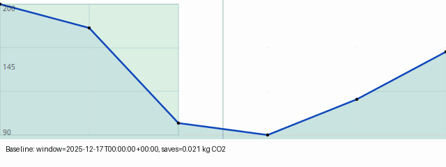

PowerApp — Full Help

Install & Developer setup (short)

- Create & activate a virtual environment:

    python -m venv .venv
    source .venv/bin/activate

- Install package and developer extras:

    pip install -e .[dev]

- Optional: ML toolchain (ONNX / sklearn) for model export and quant tests:

    pip install -e .[ml]

Recommended local files (do not commit)

- Virtual environments: `.venv/`, `venv/`, `.env/` — keep these local and do not commit.
- Local caches and logs: `.cache/`, `*.log`.
- Editor and OS files: `.vscode/`, `.idea/`, `*.swp`, `.DS_Store`.

Overview
--------
PowerApp is a lightweight GNOME desktop app that reports instantaneous power usage and energy estimates for laptops and desktops. It uses system telemetry (upower, RAPL) where available and provides recommendations to reduce power consumption.

Main features
-------------
- Live power readings (W) and a sparkline of recent usage
- Export recent history to CSV with smart filename suggestions
- Preview and copy sample timestamps and values
- Display timestamps in your preferred timezone via Settings → "Timezone" (IANA name or leave blank for system local)
- Emissions + cost calculator (coming soon)

Privacy & Data Handling
-----------------------
- PowerApp only reads local system telemetry (e.g., /sys, upower). No telemetry leaves your machine unless you choose to share a saved CSV or report.
- Optional network features are disabled by default.

Calendar integration & privacy
------------------------------
PowerApp can optionally read your calendar to avoid suggesting postponements that conflict with events. This feature is **opt-in** — enable **Respect my calendar** in Settings to activate it. PowerApp only reads local free/busy information (event start, end, and summary) and uses it locally to filter low-carbon windows and to highlight conflicts in the simulator. No calendar data is uploaded or shared externally, and calendar information is not persisted long-term by the app. When configured to use EDS, PowerApp queries the local Evolution Data Server; if using ICS, it scans local `.ics` files (for example, under `$XDG_CONFIG_HOME/calendar` or `~/.calendar`) or a path you specify in Settings.

If calendar queries fail (e.g., EDS not available), PowerApp falls back gracefully and will continue to function without filtering calendar events.

Using the App
-------------
- Refresh: click the Refresh button to fetch an immediate sample.
- Auto-refresh: toggle automatic sampling every 5 seconds.
- Export: choose how many minutes of recent history to export and click Export CSV.
- Preview: preview and copy selected lines from the export dialog.

Simulator mini-chart visuals:
- The simulator dialog includes a mini-chart showing forecast intensity and highlights the chosen low-carbon window. You can tweak its appearance in Settings → "Simulator gridlines" and "Simulator grid opacity" to add more reference lines or make gridlines more/less prominent.
- Explainability: the Simulator provides a **Why this window?** block explaining the top contributing features and a small set of alternative windows with **Preview** buttons so you can compare expected savings across candidates without applying changes.
- Demo: a short animated demo shows how Preview updates the simulation — see `docs/assets/explainability_preview_demo.gif` or view inline:

  

Manage applied postponements
----------------------------
- **How to open:** From the main window click **Help → Manage applied** to open the "Applied postponements" dialog.
- **What it shows:** A compact list of **applied** and **scheduled** postponements (task name and window). Each row has two actions:
  - **Cancel** — attempts to cancel any scheduled backend job (systemd/at) and delete the local `.ics` file created when the suggestion was applied. This is a best-effort operation and may require system permissions depending on your scheduler setup.
  - **Remove** — drops the local record only (does not contact the scheduler), useful if you want to keep the scheduled job but clean up local UI state.
- **Persistence & undo:** Changes are persisted to Settings and survive restarts; the Apply flow also shows a short Undo transient after applying a suggestion.

Shortcuts
---------
- Ctrl+A: Select all text in the Export Preview dialog
- Ctrl+C: Copy selected text
- Ctrl+Shift+C: Copy the entire preview (also available via the Copy All button)

Advanced topics
---------------
- RAPL sampling: On some systems, RAPL counters require extra permissions to read. PowerApp offers a privileged helper design to sample RAPL securely without running the UI as root.
- Packaging: The app is targeted as a Snap for Ubuntu App Center and optionally as a Flatpak for Flathub.

Power profile & systemd user timers (help)
------------------------------------------
PowerApp can optionally change the system power profile when applying a postponement (for example, to temporarily switch to `power-saver`). This requires two things on most Linux distributions:

- a power profile helper: `powerprofilesctl` (part of the power-profiles-daemon package)
- a running systemd *user* instance so that PowerApp can schedule a per-user timer to restore the original profile when the postponement ends

Installation examples (run as root):

Ubuntu / Debian (apt):

    sudo apt update && sudo apt install -y power-profiles-daemon xdg-utils

Fedora / RPM (dnf):

    sudo dnf install -y power-profiles-daemon xdg-utils

Arch (pacman):

    sudo pacman -Syu power-profiles-daemon xdg-utils

openSUSE (zypper):

    sudo zypper install -y power-profiles-daemon xdg-utils

Enabling systemd user timers

Most modern desktops already run a systemd user session. To verify that a user session exists, run:

    systemctl --user --version

If you don't have a systemd user instance, consult your distribution or session manager documentation. On Flatpak, the application sandbox needs permission to run system commands or the corresponding portal; consult Flatpak docs for granting permissions to `xdg-open` and allowlisted portal APIs.

If you're packaging PowerApp as a Flatpak, consider adding the appropriate portal permissions and documenting the needed overrides for advanced features.

Distro-specific D-Bus & tool notes
---------------------------------
PowerApp attempts to set and read power profiles using `powerprofilesctl` when available. When the CLI is not present it falls back to D-Bus calls via `gdbus` or `busctl` (best-effort). Different distributions and power-profile implementations expose slightly different service names and methods; below are the typical signals to expect.

Ubuntu / Debian
- Common CLI: `powerprofilesctl` (provided by `power-profiles-daemon`) — prefer this when available.
- D-Bus: expect `org.freedesktop.powerprofiles` service at `/org/freedesktop/powerprofiles` with iface `org.freedesktop.powerprofiles` and properties like `ActiveProfile` or methods like `SetActiveProfile`.

Fedora / RHEL
- Common CLI: `powerprofilesctl` (also available via `power-profiles-daemon`).
- D-Bus: many Fedora builds expose `org.freedesktop.PowerProfiles` at `/org/freedesktop/PowerProfiles` with iface `org.freedesktop.PowerProfiles` and `ActiveProfile`/`SetActiveProfile`.

Troubleshooting
- If PowerApp reports it cannot change the power profile:
  - Verify `powerprofilesctl` is installed and runnable (try `powerprofilesctl get`).
  - Verify a user systemd instance is present (`systemctl --user --version`).
  - Check whether `gdbus` or `busctl` are available (these provide alternate D-Bus access methods).
  - Use `gdbus` to inspect properties, for example:

      gdbus call --session --dest org.freedesktop.powerprofiles --object-path /org/freedesktop/powerprofiles --method org.freedesktop.DBus.Properties.Get org.freedesktop.powerprofiles ActiveProfile

- On Flatpak, ensure you grant access to call helper commands or document an appropriate portal for the features in your runtime manifest.

Quantization CI runner
----------------------
To run the `Quantize & Verify` job in `.github/workflows/quantize-verify.yml` the repository needs a self-hosted runner with the label `quant`. The `quantize` job uses the runner selector `[self-hosted, linux, quant]` so only runners matching those labels will pick it up.

Required software on the runner (example):
- Python packages: `onnx`, `onnxruntime` (with quantization support), `onnxruntime-tools`, `skl2onnx`, `scikit-learn`, `numpy`
- System packages (Ubuntu example): `build-essential`, `python3-dev`, `python3-venv` and any native libs needed by `onnxruntime` on your distro.

Example setup (Ubuntu):

    sudo apt update && sudo apt install -y build-essential python3-dev python3-venv
    python3 -m venv .venv && . .venv/bin/activate
    pip install --upgrade pip
    pip install onnx onnxruntime onnxruntime-tools skl2onnx scikit-learn numpy

When registering a self-hosted runner for this repo, add the `quant` label during registration. If a suitable runner is not present the `quantize` job will remain pending in the Actions UI. You can run the workflow manually from the Actions page after adding a matching runner.

Packaging metadata added in the repository:
- `pyproject.toml` lists runtime Python dependencies (Markdown).
- `snap/snapcraft.yaml` is a template showing how to stage WebKit2 and include Markdown in the Python environment.
- `flatpak/org.example.powerapp.json` is a sample Flatpak manifest that installs Markdown at build time and targets `org.gnome.Platform`.

See the `snap/` and `flatpak/` folders for packaging examples and adapt them to your CI / build environment.

Snap Store publishing (CI)
--------------------------
To enable automatic CI publishing to the Snap Store, add a secret named `SNAPCRAFT_LOGIN` to the repository secrets. Create the secret by exporting your Snapcraft login assertion on a machine where you are logged into snapcraft with:

  snapcraft export-login --snaps --snaps-assertion > snapcraft.login

Then copy the contents of `snapcraft.login` into the `SNAPCRAFT_LOGIN` repository secret. The CI job `snap-publish` will use this secret to log in and run `snapcraft upload powerapp.snap --release=stable` on pushes to `main`.

Be sure to keep the secret private and rotate it if you suspect it has been exposed.

Tag-based promotion
-------------------
A separate workflow `snap-promote` runs when you push a tag starting with `v` (for example `v1.2.3` or `v1.2.3-beta`). The workflow builds the snap and uploads it to a channel based on the tag name:

- Tags containing `beta` (e.g., `v1.2.3-beta`) will be uploaded to the `beta` channel.
- Other `v*` tags will be uploaded to the `stable` channel.

You can also trigger the workflow manually from the Actions tab using the `Run workflow` button (workflow_dispatch). If you want different promotion rules (e.g., `rc` -> `candidate`), I can add them.

Dependencies for richer help rendering
-------------------------------------
To render the built-in help as HTML in the app you can install WebKit2 and the Python Markdown package.

Ubuntu/Debian (recommended):

sudo apt update && sudo apt install -y gir1.2-webkit2-4.0 libwebkit2gtk-4.0-dev xdg-utils
python3 -m pip install --user Markdown

If those are not installed, PowerApp will still show the help as plain text.

Contributing
------------
Please see `CONTRIBUTING.md` for contribution guidelines and coding standards (includes visual testing/golden image instructions). The project is MIT licensed.

Acknowledgements
----------------
This is a prototype intended for demonstration and user feedback. If you have hardware-specific insights or additional data sources, please open an issue or a pull request.
