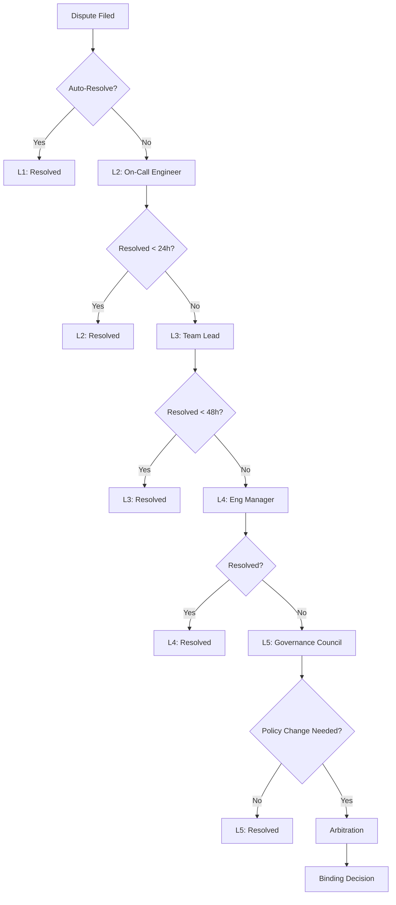

# Grey Distributed — Dispute Resolution

This document describes the dispute resolution process for Grey Distributed, including workflows, escalation paths, and arbitration mechanisms.

## Overview

Grey's dispute resolution framework provides a structured, fair process for resolving conflicts between tenants, between tenants and the platform, and between federated organizations.

```
┌─────────────────────────────────────────────────────────────────────────────┐
│                      Dispute Resolution Pipeline                             │
├─────────────────────────────────────────────────────────────────────────────┤
│                                                                              │
│   ┌───────────┐    ┌───────────┐    ┌───────────┐    ┌───────────┐         │
│   │  Dispute  │───▶│ Automated │───▶│  Human    │───▶│   Final   │         │
│   │  Filed    │    │ Triage    │    │  Review   │    │ Arbitration│         │
│   └───────────┘    └───────────┘    └───────────┘    └───────────┘         │
│        │                │                │                │                 │
│        ▼                ▼                ▼                ▼                 │
│   ┌───────────┐    ┌───────────┐    ┌───────────┐    ┌───────────┐         │
│   │ Evidence  │    │ Auto      │    │ Mediation │    │ Binding   │         │
│   │ Collection│    │ Resolution│    │ Attempt   │    │ Decision  │         │
│   └───────────┘    └───────────┘    └───────────┘    └───────────┘         │
│                                                                              │
└─────────────────────────────────────────────────────────────────────────────┘
```

## Dispute Categories

### Resource Disputes

| Category | Description | Typical Resolution |
|----------|-------------|-------------------|
| **Quota Violation** | Tenant exceeded quota without authorization | Automatic rate limiting + warning |
| **Resource Contention** | Multiple tenants competing for resources | DRF rebalancing |
| **Burst Abuse** | Excessive burst usage affecting others | Burst privilege revocation |
| **Preemption Complaint** | Task preempted unfairly | Priority review |

### SLA Disputes

| Category | Description | Typical Resolution |
|----------|-------------|-------------------|
| **Availability Breach** | Platform didn't meet uptime SLA | Service credits |
| **Latency Violation** | P99 latency exceeded SLA | Root cause analysis |
| **Support Response** | Support didn't respond in time | Compensation + process improvement |
| **Data Loss** | Data corruption or loss | Recovery + compensation |

### Policy Disputes

| Category | Description | Typical Resolution |
|----------|-------------|-------------------|
| **False Positive** | Policy incorrectly blocked valid request | Policy refinement |
| **Policy Conflict** | Conflicting policies created deadlock | Policy reconciliation |
| **Unfair Enforcement** | Inconsistent policy application | Policy audit |

### Federation Disputes

| Category | Description | Typical Resolution |
|----------|-------------|-------------------|
| **Resource Sharing** | Partner not honoring resource agreement | Arbitration |
| **Attestation Failure** | Partner attestation rejected | Technical review |
| **Cross-Org Violation** | Partner violated federation agreement | Escalation to governance council |

## Dispute Lifecycle

### State Machine

```
                    ┌───────────────────────────────────────┐
                    │                                       │
                    ▼                                       │
┌──────────┐    ┌──────────┐    ┌──────────┐    ┌──────────┐
│  OPEN    │───▶│ TRIAGING │───▶│INVESTIGATING──▶│ RESOLVED │
└──────────┘    └──────────┘    └──────────┘    └──────────┘
     │               │               │               ▲
     │               │               │               │
     │               ▼               ▼               │
     │          ┌──────────┐    ┌──────────┐        │
     │          │AUTO_RESOL│───▶│ CLOSED   │        │
     │          └──────────┘    └──────────┘        │
     │                              ▲                │
     │                              │                │
     ▼                              │                │
┌──────────┐    ┌──────────┐    ┌──────────┐        │
│ PENDING  │───▶│ ESCALATED│───▶│ARBITRATING───────┘
│ TENANT   │    └──────────┘    └──────────┘
└──────────┘
     │
     │          ┌──────────┐
     └─────────▶│ WITHDRAWN│
                └──────────┘
```

### State Definitions

| State | Description | Actions Available |
|-------|-------------|-------------------|
| **OPEN** | Dispute just filed | Assign, Auto-triage |
| **TRIAGING** | Automated classification in progress | Wait, Override |
| **AUTO_RESOLVED** | Automatically resolved | Close, Reopen |
| **INVESTIGATING** | Human reviewer examining | Request info, Mediate |
| **PENDING_TENANT** | Waiting for tenant response | Respond, Withdraw |
| **ESCALATED** | Moved to higher authority | Review, Arbitrate |
| **ARBITRATING** | Final arbitration in progress | Decision pending |
| **RESOLVED** | Decision made and accepted | Appeal (limited) |
| **CLOSED** | Dispute fully closed | Reopen (within 7 days) |
| **WITHDRAWN** | Tenant withdrew dispute | Reopen (within 24h) |

## Dispute Resolution Workflow

### Step 1: Filing a Dispute

```yaml
# API: POST /api/v1/disputes
dispute:
  type: sla_breach
  category: availability
  priority: high
  
  tenant_id: tenant-acme
  affected_resources:
    - type: task
      ids: [task-123, task-456]
    - type: namespace
      ids: [prod-workloads]
      
  description: |
    Service was unavailable for 45 minutes on 2024-01-15
    between 14:00 and 14:45 UTC. This exceeds our 99.9%
    availability SLA for the enterprise tier.
    
  evidence:
    - type: metrics
      query: "grey_availability{tenant='acme', namespace='prod'}"
      time_range: "2024-01-15T13:00:00Z/2024-01-15T16:00:00Z"
    - type: logs
      query: "tenant:acme AND level:error"
      time_range: "2024-01-15T14:00:00Z/2024-01-15T14:45:00Z"
    - type: trace
      trace_ids: [abc123, def456]
      
  requested_resolution:
    type: service_credit
    amount: 500
    justification: "45 min downtime = 0.06% of monthly uptime"
```

### Step 2: Automated Triage

The system automatically classifies and prioritizes disputes:

```
┌─────────────────────────────────────────────────────────────────┐
│                    Automated Triage Engine                       │
├─────────────────────────────────────────────────────────────────┤
│                                                                  │
│  Input: Dispute Filing                                           │
│                                                                  │
│  ┌─────────────────────────────────────────────────────────┐    │
│  │ 1. CLASSIFICATION                                        │    │
│  │    - Category detection (NLP + rules)                    │    │
│  │    - Impact assessment                                   │    │
│  │    - Historical pattern matching                         │    │
│  └─────────────────────────────────────────────────────────┘    │
│                         │                                        │
│                         ▼                                        │
│  ┌─────────────────────────────────────────────────────────┐    │
│  │ 2. EVIDENCE VALIDATION                                   │    │
│  │    - Verify metric queries are valid                     │    │
│  │    - Cross-reference with system logs                    │    │
│  │    - Calculate actual vs claimed impact                  │    │
│  └─────────────────────────────────────────────────────────┘    │
│                         │                                        │
│                         ▼                                        │
│  ┌─────────────────────────────────────────────────────────┐    │
│  │ 3. AUTO-RESOLUTION CHECK                                 │    │
│  │    - Does this match a known pattern?                    │    │
│  │    - Is automated remediation available?                 │    │
│  │    - Does tenant tier allow auto-resolution?             │    │
│  └─────────────────────────────────────────────────────────┘    │
│                         │                                        │
│              ┌──────────┴──────────┐                             │
│              │                     │                             │
│              ▼                     ▼                             │
│     ┌─────────────┐       ┌─────────────┐                       │
│     │AUTO-RESOLVE │       │   ASSIGN    │                       │
│     │ (if simple) │       │  TO HUMAN   │                       │
│     └─────────────┘       └─────────────┘                       │
│                                                                  │
└─────────────────────────────────────────────────────────────────┘
```

### Step 3: Investigation

For disputes requiring human review:

```yaml
investigation:
  dispute_id: DSP-2024-0115-001
  investigator: platform-team-lead
  
  timeline:
    - timestamp: "2024-01-15T16:00:00Z"
      action: assigned
      by: auto-triage
      
    - timestamp: "2024-01-15T16:15:00Z"
      action: evidence_reviewed
      by: platform-team-lead
      notes: "Metrics confirm 45-minute availability drop"
      
    - timestamp: "2024-01-15T16:30:00Z"
      action: root_cause_identified
      by: platform-team-lead
      notes: "Network partition in us-east-1a affected tenant namespace"
      
    - timestamp: "2024-01-15T17:00:00Z"
      action: resolution_proposed
      by: platform-team-lead
      proposal:
        credit_amount: 500
        additional_actions:
          - implement_multi_az_failover
          - add_monitoring_for_network_partitions
```

### Step 4: Resolution

```yaml
resolution:
  dispute_id: DSP-2024-0115-001
  status: resolved
  
  outcome:
    type: accepted_with_modifications
    credit_issued: 450
    credit_reason: "45 min downtime adjusted for maintenance window (5 min excluded)"
    
  corrective_actions:
    - id: CA-001
      description: "Enable multi-AZ failover for enterprise tenants"
      owner: platform-team
      due_date: "2024-02-01"
      status: in_progress
      
    - id: CA-002
      description: "Add network partition detection alerting"
      owner: sre-team
      due_date: "2024-01-22"
      status: completed
      
  tenant_satisfaction:
    surveyed: true
    score: 4
    feedback: "Quick resolution, appreciate the proactive improvements"
```

## Escalation Paths

### Escalation Criteria

| Level | Criteria | Escalation To |
|-------|----------|---------------|
| **L1** | Initial filing | Automated triage |
| **L2** | Auto-resolution failed | On-call engineer |
| **L3** | > 24h unresolved or high priority | Team lead |
| **L4** | > 48h unresolved or critical | Engineering manager |
| **L5** | Unresolved after L4 or policy dispute | Governance council |
| **ARBITRATION** | L5 failed or cross-org dispute | External arbitrator |

### Escalation Workflow



## SLA Response Times

| Dispute Priority | Acknowledgment | Triage Complete | Resolution Target |
|------------------|----------------|-----------------|-------------------|
| **Critical** | 15 min | 1 hour | 4 hours |
| **High** | 1 hour | 4 hours | 24 hours |
| **Medium** | 4 hours | 24 hours | 72 hours |
| **Low** | 24 hours | 48 hours | 7 days |

### Priority Determination

```yaml
priority_matrix:
  critical:
    conditions:
      - type: impact
        value: "complete_service_outage"
      - type: tenant_tier
        value: "enterprise"
      - type: affected_scope
        value: "production"
        
  high:
    conditions:
      - type: impact
        value: "partial_degradation"
      - type: sla_breach
        value: true
      - type: tenant_tier
        value: ["enterprise", "business"]
        
  medium:
    conditions:
      - type: impact
        value: "minor_inconvenience"
      - type: recurring_issue
        value: true
        
  low:
    conditions:
      - type: impact
        value: "cosmetic_or_feature_request"
      - type: workaround_available
        value: true
```

## Arbitration Process

### When Arbitration is Required

- L5 escalation failed to achieve consensus
- Cross-organization disputes in federation
- Policy interpretation conflicts
- Significant financial claims (> $10,000)
- Precedent-setting decisions

### Arbitration Panel

```
┌─────────────────────────────────────────────────────────────────┐
│                     Arbitration Panel                            │
├─────────────────────────────────────────────────────────────────┤
│                                                                  │
│   ┌─────────────────┐                                           │
│   │  Neutral Chair  │  (External, rotating quarterly)           │
│   └────────┬────────┘                                           │
│            │                                                     │
│     ┌──────┴──────┐                                             │
│     ▼             ▼                                             │
│  ┌──────────┐  ┌──────────┐                                     │
│  │ Platform │  │  Tenant  │                                     │
│  │   Rep    │  │   Rep    │                                     │
│  └──────────┘  └──────────┘                                     │
│                                                                  │
│  For federation disputes:                                        │
│                                                                  │
│  ┌──────────┐  ┌──────────┐  ┌──────────┐                       │
│  │  Org A   │  │  Org B   │  │ Neutral  │                       │
│  │   Rep    │  │   Rep    │  │  Chair   │                       │
│  └──────────┘  └──────────┘  └──────────┘                       │
│                                                                  │
└─────────────────────────────────────────────────────────────────┘
```

### Arbitration Procedure

1. **Filing** (Day 0-3)
   - Written statement from each party
   - All evidence submitted
   - Witness list provided

2. **Discovery** (Day 4-14)
   - Document exchange
   - Technical analysis
   - Expert consultations

3. **Hearing** (Day 15-17)
   - Opening statements
   - Evidence presentation
   - Cross-examination
   - Closing arguments

4. **Deliberation** (Day 18-21)
   - Panel reviews evidence
   - Consensus building
   - Draft decision

5. **Decision** (Day 22-28)
   - Written decision issued
   - Binding on all parties
   - Appeal window (7 days, limited grounds)

### Decision Enforcement

```yaml
enforcement:
  decision_id: ARB-2024-001
  issued: "2024-01-28"
  
  ruling:
    in_favor_of: tenant-acme
    
  remedies:
    - type: financial
      amount: 15000
      currency: USD
      due_date: "2024-02-28"
      
    - type: corrective_action
      description: "Implement dedicated capacity for enterprise tenants"
      due_date: "2024-03-31"
      verification: quarterly_audit
      
    - type: policy_change
      description: "Update preemption policy to protect guaranteed resources"
      scope: global
      effective_date: "2024-02-15"
      
  compliance_monitoring:
    frequency: monthly
    duration: 6_months
    reporter: neutral_auditor
```

## Compensation Framework

### Service Credits

| SLA Breach Type | Credit Calculation |
|-----------------|-------------------|
| Availability < SLA | (SLA% - Actual%) × Monthly fee × 10 |
| Latency P99 > SLA | Minutes exceeding × $0.10/min |
| Support Response > SLA | Hours delayed × $50/hour |
| Data Loss | Per-incident evaluation |

### Credit Caps

| Tenant Tier | Maximum Monthly Credit |
|-------------|------------------------|
| Enterprise | 100% of monthly fee |
| Business | 50% of monthly fee |
| Standard | 25% of monthly fee |

### Non-Financial Remedies

- Priority support queue access
- Extended burst allowances
- Dedicated capacity reservations
- Policy exceptions
- Direct escalation paths

## Prevention and Improvement

### Post-Mortem Process

Every resolved dispute triggers a review:

```yaml
post_mortem:
  dispute_id: DSP-2024-0115-001
  
  summary:
    incident_type: availability
    duration: 45_minutes
    impact: single_tenant
    root_cause: network_partition
    
  timeline:
    - time: "T-0:05"
      event: "AZ-1a network degradation detected"
    - time: "T+0:00"
      event: "Full network partition"
    - time: "T+0:15"
      event: "Monitoring alert triggered"
    - time: "T+0:30"
      event: "Failover initiated"
    - time: "T+0:45"
      event: "Service restored"
      
  action_items:
    - id: PM-001
      category: detection
      description: "Reduce partition detection time from 15min to 2min"
      owner: sre-team
      
    - id: PM-002
      category: mitigation
      description: "Enable automatic failover for network partitions"
      owner: platform-team
      
    - id: PM-003
      category: prevention
      description: "Implement multi-path networking"
      owner: infrastructure-team
      
  lessons_learned:
    - "Single-AZ deployments create unnecessary risk for enterprise tenants"
    - "Monitoring gap allowed 15 minutes before detection"
    - "Manual failover process too slow for SLA compliance"
```

### Trend Analysis

```
┌─────────────────────────────────────────────────────────────────┐
│                  Dispute Trend Dashboard                         │
├─────────────────────────────────────────────────────────────────┤
│                                                                  │
│  Monthly Disputes by Category                                    │
│  ════════════════════════════                                   │
│                                                                  │
│  SLA Breach      ████████████████░░░░░░░░░░░░░░░  45%           │
│  Resource        ██████████░░░░░░░░░░░░░░░░░░░░░  28%           │
│  Policy          ████████░░░░░░░░░░░░░░░░░░░░░░░  18%           │
│  Federation      ███░░░░░░░░░░░░░░░░░░░░░░░░░░░░   9%           │
│                                                                  │
│  Resolution Time Trend (days)                                    │
│  ═════════════════════════════                                  │
│                                                                  │
│  5 │                                                             │
│  4 │ ●                                                           │
│  3 │    ●  ●                                                     │
│  2 │          ●  ●  ●                                            │
│  1 │                   ●  ●  ●  ●                                │
│    └─────────────────────────────▶                              │
│     Jan Feb Mar Apr May Jun Jul Aug                             │
│                                                                  │
└─────────────────────────────────────────────────────────────────┘
```

## Governance Council

### Composition

| Role | Responsibilities |
|------|------------------|
| **Platform Rep** | Technical perspective, policy enforcement |
| **Tenant Rep** | Tenant advocacy, fairness oversight |
| **Security Rep** | Security policy, compliance |
| **Legal Rep** | Contractual obligations, liability |
| **Independent Chair** | Neutral facilitation, tie-breaking |

### Meeting Cadence

- **Monthly**: Regular review of dispute trends, policy adjustments
- **Quarterly**: Major policy changes, process improvements
- **Ad-hoc**: Critical disputes requiring immediate attention

## API Reference

### Submit Dispute

```http
POST /api/v1/disputes
Content-Type: application/json

{
  "type": "sla_breach",
  "category": "availability",
  "description": "...",
  "evidence": [...],
  "requested_resolution": {...}
}
```

### Check Dispute Status

```http
GET /api/v1/disputes/{dispute_id}
```

### Add Evidence

```http
POST /api/v1/disputes/{dispute_id}/evidence
Content-Type: application/json

{
  "type": "metrics",
  "query": "...",
  "time_range": "..."
}
```

### Escalate Dispute

```http
POST /api/v1/disputes/{dispute_id}/escalate
Content-Type: application/json

{
  "reason": "Not resolved within SLA",
  "requested_action": "manager_review"
}
```

### Accept Resolution

```http
POST /api/v1/disputes/{dispute_id}/accept
```

### Appeal Decision

```http
POST /api/v1/disputes/{dispute_id}/appeal
Content-Type: application/json

{
  "grounds": "procedural_error",
  "new_evidence": [...]
}
```

## References

- [Governance Framework](governance_framework.md)
- [Federation Architecture](federation_architecture.md)
- [Dispute Resolution Policy](../policies/dispute_resolution.yaml)
- [Tenant Rights Policy](../policies/tenant_rights.yaml)
