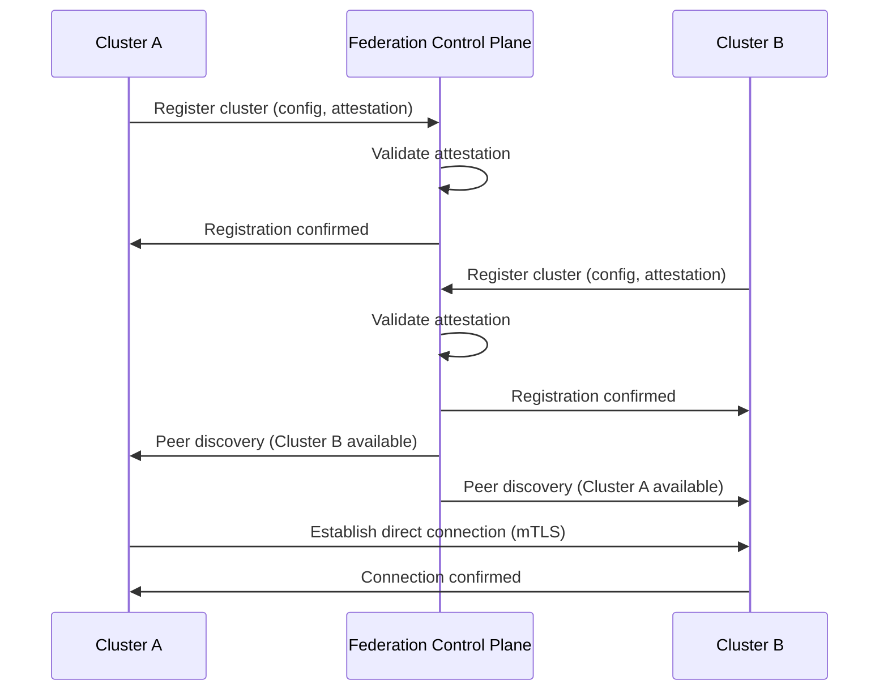
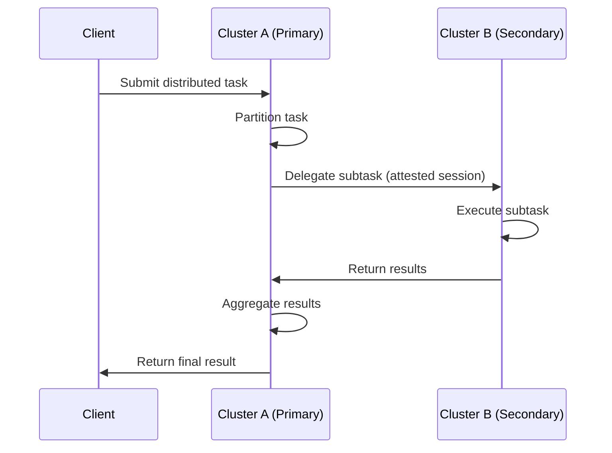
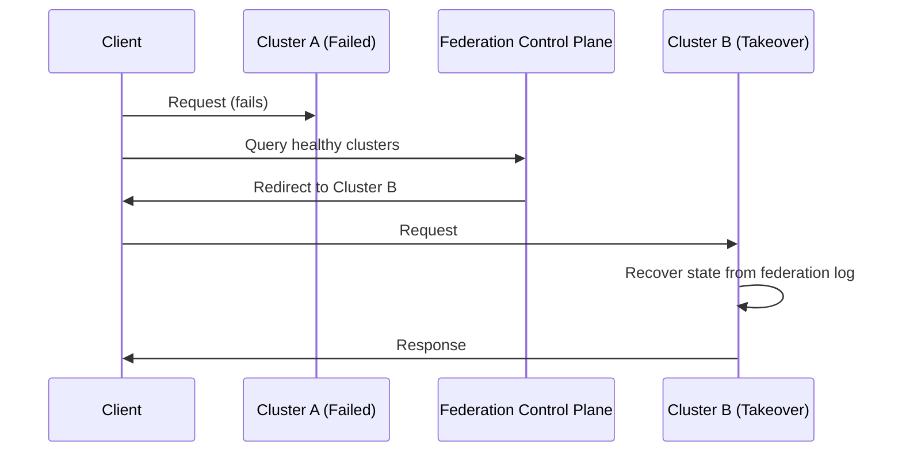

# Grey Distributed — Federation Architecture

This document describes the architecture for federating Grey clusters across multiple cloud providers, on-premises datacenters, and edge locations.

## Overview

Grey Federation enables organizations to:

- **Multi-Cloud Deployment**: Run unified workloads across AWS, GCP, Azure, and on-premises infrastructure
- **Geographic Distribution**: Place compute near data sources and users
- **Hybrid Architectures**: Combine cloud elasticity with on-premises security
- **Organizational Boundaries**: Federate clusters across business units or partner organizations

```
┌─────────────────────────────────────────────────────────────────────────────┐
│                         Grey Federation Control Plane                        │
├─────────────────────────────────────────────────────────────────────────────┤
│  ┌─────────────────┐  ┌─────────────────┐  ┌─────────────────┐              │
│  │   Attestation   │  │    Consensus    │  │   Resource      │              │
│  │     Service     │  │    Coordinator  │  │   Arbiter       │              │
│  └────────┬────────┘  └────────┬────────┘  └────────┬────────┘              │
│           │                    │                    │                        │
│  ┌────────┴────────────────────┴────────────────────┴────────┐              │
│  │                    Federation Bus (gRPC/mTLS)              │              │
│  └────────┬────────────────────┬────────────────────┬────────┘              │
└───────────┼────────────────────┼────────────────────┼────────────────────────┘
            │                    │                    │
    ┌───────▼───────┐    ┌───────▼───────┐    ┌───────▼───────┐
    │  AWS Cluster  │    │  GCP Cluster  │    │  On-Prem      │
    │  (us-east-1)  │    │  (us-central1)│    │  (DC-EAST)    │
    │               │    │               │    │               │
    │ ┌───────────┐ │    │ ┌───────────┐ │    │ ┌───────────┐ │
    │ │ Federation│ │    │ │ Federation│ │    │ │ Federation│ │
    │ │ Connector │ │    │ │ Connector │ │    │ │ Connector │ │
    │ └───────────┘ │    │ └───────────┘ │    │ └───────────┘ │
    │ ┌───────────┐ │    │ ┌───────────┐ │    │ ┌───────────┐ │
    │ │   Grey    │ │    │ │   Grey    │ │    │ │   Grey    │ │
    │ │  Runtime  │ │    │ │  Runtime  │ │    │ │  Runtime  │ │
    │ └───────────┘ │    │ └───────────┘ │    │ └───────────┘ │
    └───────────────┘    └───────────────┘    └───────────────┘
```

## Core Components

### 1. Federation Connectors

Each cloud provider and infrastructure type has a dedicated connector:

| Connector | Authentication | Network | Encryption |
|-----------|----------------|---------|------------|
| AWS | IAM STS / IRSA | VPC Peering | KMS |
| GCP | Workload Identity | VPC Peering | Cloud KMS |
| Azure | Entra ID / MI | VNet Peering | Key Vault |
| On-Prem | mTLS (X.509) | VPN/Direct | HSM/TPM |

#### Connector Responsibilities

1. **Authentication**: Establish identity with remote clusters
2. **Network Setup**: Configure secure connectivity (peering, VPN)
3. **Attestation**: Prove platform integrity to peers
4. **Key Exchange**: Encrypt cross-cluster traffic
5. **Health Monitoring**: Track connection state

### 2. Attestation Service

The attestation service verifies the integrity of federated clusters before allowing them to participate in the federation.

```
┌─────────────────────────────────────────────────────────────┐
│                    Attestation Flow                          │
├─────────────────────────────────────────────────────────────┤
│                                                              │
│   Cluster A                                    Cluster B     │
│   ─────────                                    ─────────     │
│       │                                            │         │
│       │  1. Generate Attestation                   │         │
│       │     (TPM quote, instance identity)         │         │
│       │                                            │         │
│       │  2. Sign with platform key                 │         │
│       │     ──────────────────────────────────▶    │         │
│       │                                            │         │
│       │                  3. Verify signature       │         │
│       │                     Check PCR values       │         │
│       │                     Validate identity      │         │
│       │                                            │         │
│       │  4. Return attestation result              │         │
│       │     ◀──────────────────────────────────    │         │
│       │                                            │         │
│       │  5. Exchange session keys                  │         │
│       │     ◀─────────────────────────────────▶    │         │
│       │                                            │         │
└───────┴────────────────────────────────────────────┴─────────┘
```

#### Attestation Types

| Type | Platform | Trust Anchor |
|------|----------|--------------|
| TPM 2.0 | On-prem, some cloud | Hardware TPM |
| vTPM | AWS Nitro, GCP Shielded | Virtual TPM |
| SEV/SNP | AMD EPYC | CPU memory encryption |
| SGX | Intel | Enclave attestation |
| Instance Identity | All clouds | Cloud provider PKI |

### 3. Inter-Cluster Consensus

Grey uses a hierarchical consensus model for cross-cluster coordination:

```
                    ┌───────────────────┐
                    │ Federation Leader │
                    │   (Rotating)      │
                    └─────────┬─────────┘
                              │
              ┌───────────────┼───────────────┐
              │               │               │
      ┌───────▼───────┐ ┌─────▼─────┐ ┌───────▼───────┐
      │ Cluster A     │ │ Cluster B │ │ Cluster C     │
      │ (Follower)    │ │ (Follower)│ │ (Follower)    │
      └───────────────┘ └───────────┘ └───────────────┘
```

#### Consensus Scope

| Scope | Mechanism | Latency Target |
|-------|-----------|----------------|
| Intra-cluster | Raft | < 10ms |
| Inter-cluster (same region) | Federated Raft | < 50ms |
| Inter-cluster (cross-region) | Paxos variant | < 200ms |
| Cross-cloud | Optimistic coordination | < 500ms |

### 4. Resource Sharing

Federation enables resource sharing across organizational boundaries:

```yaml
# Resource sharing agreement
agreement:
  provider: org-a/cluster-us-east
  consumer: org-b/cluster-us-west
  
  resources:
    cpu:
      limit: 1000 cores
      priority: 0.8
    memory:
      limit: 4 TB
      priority: 0.8
    
  scheduling:
    preemption: allowed
    max_burst: 1.5x
    
  billing:
    model: pay-per-use
    rate_card: standard-2024
```

## Network Architecture

### Cross-Cloud Connectivity

```
┌─────────────────────────────────────────────────────────────────────────┐
│                          Network Topology                                │
├─────────────────────────────────────────────────────────────────────────┤
│                                                                          │
│   AWS VPC (10.0.0.0/16)          GCP VPC (10.1.0.0/16)                  │
│   ┌─────────────────┐            ┌─────────────────┐                    │
│   │                 │            │                 │                    │
│   │  Grey Cluster   │◀──VPN────▶│  Grey Cluster   │                    │
│   │  us-east-1      │  Tunnel   │  us-central1    │                    │
│   │                 │            │                 │                    │
│   └────────┬────────┘            └────────┬────────┘                    │
│            │                              │                              │
│            │ VPC Peering                  │ VPC Peering                 │
│            ▼                              ▼                              │
│   ┌─────────────────┐            ┌─────────────────┐                    │
│   │  AWS Transit    │◀──────────▶│  Cloud          │                    │
│   │  Gateway        │  Dedicated │  Interconnect   │                    │
│   │                 │  Link      │                 │                    │
│   └─────────────────┘            └─────────────────┘                    │
│            │                              │                              │
│            └──────────────┬───────────────┘                              │
│                           │                                              │
│                  ┌────────▼────────┐                                     │
│                  │  On-Premises    │                                     │
│                  │  (10.2.0.0/16)  │                                     │
│                  │                 │                                     │
│                  │  Grey Cluster   │                                     │
│                  │  DC-EAST        │                                     │
│                  └─────────────────┘                                     │
│                                                                          │
└─────────────────────────────────────────────────────────────────────────┘
```

### Network Security

All inter-cluster traffic is encrypted:

1. **Transport Layer**: TLS 1.3 with mTLS
2. **Application Layer**: End-to-end encryption with cluster-specific keys
3. **Key Management**: Cloud KMS or on-prem HSM

```
┌────────────────────────────────────────────────────────────┐
│                  Encryption Layers                          │
├────────────────────────────────────────────────────────────┤
│                                                             │
│   ┌─────────────────────────────────────────────────────┐  │
│   │  Application Payload (encrypted with session key)   │  │
│   │  ┌─────────────────────────────────────────────────┐│  │
│   │  │  Federation Message                             ││  │
│   │  │  - Source: cluster-a                            ││  │
│   │  │  - Dest: cluster-b                              ││  │
│   │  │  - Payload: [encrypted bytes]                   ││  │
│   │  └─────────────────────────────────────────────────┘│  │
│   └─────────────────────────────────────────────────────┘  │
│   ┌─────────────────────────────────────────────────────┐  │
│   │  TLS 1.3 (mTLS with client certificate)             │  │
│   └─────────────────────────────────────────────────────┘  │
│   ┌─────────────────────────────────────────────────────┐  │
│   │  TCP/IP                                             │  │
│   └─────────────────────────────────────────────────────┘  │
│                                                             │
└────────────────────────────────────────────────────────────┘
```

## Federation Workflow

### 1. Cluster Registration



### 2. Cross-Cluster Task Execution



### 3. Failover



## Deployment Topologies

### Hub-and-Spoke

Best for: Centralized coordination with edge deployments

```
            ┌───────────────────┐
            │   Hub Cluster     │
            │   (Cloud/DC)      │
            └─────────┬─────────┘
                      │
        ┌─────────────┼─────────────┐
        │             │             │
   ┌────▼────┐   ┌────▼────┐   ┌────▼────┐
   │  Edge   │   │  Edge   │   │  Edge   │
   │  Site 1 │   │  Site 2 │   │  Site 3 │
   └─────────┘   └─────────┘   └─────────┘
```

### Full Mesh

Best for: Low-latency peer-to-peer coordination

```
   ┌───────────┐         ┌───────────┐
   │ Cluster A │◀───────▶│ Cluster B │
   └─────┬─────┘         └─────┬─────┘
         │                     │
         │    ┌───────────┐    │
         └───▶│ Cluster C │◀───┘
              └─────┬─────┘
                    │
              ┌─────▼─────┐
              │ Cluster D │
              └───────────┘
         (All nodes interconnected)
```

### Hierarchical

Best for: Multi-region with regional autonomy

```
            ┌─────────────────────┐
            │   Global Leader     │
            │   (Coordination)    │
            └──────────┬──────────┘
                       │
     ┌─────────────────┼─────────────────┐
     │                 │                 │
┌────▼────┐       ┌────▼────┐       ┌────▼────┐
│ Region  │       │ Region  │       │ Region  │
│ Leader  │       │ Leader  │       │ Leader  │
│ US      │       │ EU      │       │ APAC    │
└────┬────┘       └────┬────┘       └────┬────┘
     │                 │                 │
  ┌──┴──┐           ┌──┴──┐           ┌──┴──┐
  │ │ │ │           │ │ │ │           │ │ │ │
 Clusters          Clusters          Clusters
```

## Security Considerations

### Trust Boundaries

| Boundary | Trust Level | Verification |
|----------|-------------|--------------|
| Same cluster | High | Internal PKI |
| Same organization, different cluster | Medium | Cross-cluster attestation |
| Different organization | Low | Full attestation + governance policies |

### Defense in Depth

1. **Network Isolation**: VPC peering with explicit allow-lists
2. **mTLS Everywhere**: All communication uses mutual TLS
3. **Attestation**: Hardware-backed platform verification
4. **Encryption**: End-to-end encryption for sensitive data
5. **Audit Logging**: All cross-cluster operations logged
6. **Rate Limiting**: Protection against DoS attacks

### Compliance

| Framework | Relevant Controls |
|-----------|-------------------|
| SOC 2 | CC6.1, CC6.6, CC6.7 (Logical access, Encryption) |
| ISO 27001 | A.13.1 (Network security), A.14.1 (Secure development) |
| PCI DSS | 1.3, 4.1 (Firewall, Encryption) |
| HIPAA | §164.312 (Technical safeguards) |

## Operational Considerations

### Monitoring

Key metrics to track:

- **Connection health**: UP/DOWN status per cluster pair
- **Latency**: P50, P95, P99 cross-cluster latency
- **Throughput**: Bytes transferred per cluster pair
- **Attestation**: Success/failure rates, expiration warnings
- **Consensus**: Proposal/commit rates, leader elections

### Capacity Planning

```
Cross-cluster bandwidth = Σ(task_size × frequency × replication_factor)
                        + consensus_overhead
                        + attestation_refresh_overhead
                        + health_check_overhead
```

Typical overhead: 5-10% of useful bandwidth for federation coordination.

### Disaster Recovery

| Scenario | Recovery Action | RTO Target |
|----------|-----------------|------------|
| Single cluster failure | Automatic failover to peers | < 30s |
| Region outage | Cross-region failover | < 5min |
| Cloud provider outage | Multi-cloud failover | < 15min |
| Federation control plane failure | Clusters operate independently | Immediate (degraded) |

## Future Directions

1. **Zero Trust Federation**: Per-request attestation
2. **Confidential Computing**: Cross-cluster TEE coordination
3. **Quantum-Safe Cryptography**: Post-quantum key exchange
4. **AI-Driven Placement**: ML-based cross-cluster scheduling
5. **Edge-Native Federation**: Ultra-low-latency edge meshes

## References

- [Grey API Reference](api_reference.md)
- [Governance Framework](governance_framework.md)
- [Dispute Resolution](dispute_resolution.md)
- [Deployment Guide](deployment.md)
